# DISTMOB: Disturbance-Aware Mobility Control for Mobile Networks

## Executive summary

DISTMOB is a reproducible simulation and control study for access-point association under user mobility, congestion and time-varying disturbances. The final release preserves the existing controller stack but tightens the methodology around model mismatch, switch-cost ablation, frozen-trace statistics, and runtime definitions.

### Primary seed-level evidence

The primary robustness study uses **10 paired seeds**. Stable-global averages **0.9482 served-demand fraction vs 0.9275 for load-aware** (delta **+0.0206**, +2.2% relative). This improvement is **not statistically significant** after the stated multiple-comparison correction (paired t-test Holm p=0.0925; Wilcoxon Holm p=0.0840).

The stronger seed-level effects are in outage, fairness, latency and handover churn: mean outage falls from **0.2602 to 0.1692** (35.0% relative reduction; Holm t p=0.0037), Jain fairness rises from **0.7757 to 0.8674** (delta +0.0917; Holm t p=0.0130), latency proxy falls by **25.9%** (Holm t p=0.0031), and handover rate falls by **99.4%** (Holm t p=1.01e-07).

There is also a real tail-QoS cost: P05 throughput changes from **3.4521 Mbps to 3.0335 Mbps**, a delta of **-0.4186 Mbps (-12.1%)**. The paired t-test gives Holm p=0.0523; the Wilcoxon result is p=0.0645. The release therefore does **not** claim universal improvement across every QoS metric.

### Reviewer-facing fairness check

The primary stable-global controller does **not** use the evaluator's exact rate model. Its planner uses a fixed imperfect proxy: pathloss exponent 2.60 vs evaluator 2.35, planner SNR bias -1.20 dB, and planner rate scale 7.60 vs evaluator 8.00. The separate 7-seed mismatch study also measures the planner's internal predicted-rate drift versus the oracle: even when the mild and moderate proxy perturbations leave the discrete balanced-slot assignment unchanged in this scenario, their internal scores move by **20.2%** and **28.7%** of the oracle predicted-rate scale, respectively. The **strong mismatch used by the primary controller** has **43.7%** drift and still achieves **0.9392 served demand / 0.1859 outage**, versus **0.9379 / 0.2413** for load-aware. This reduces the concern that the main result is driven only by exact planner/evaluator model sharing.

### Switch-penalty degeneracy check

Removing the global switch penalty changes the controller from **0.00153 handover rate / 4.4 mean handovers** to **0.03816 / 109.9**, while served demand changes from **0.9488 to 0.9864** and outage from **0.1741 to 0.0679**. In other words, the low-churn behavior is not accidental: removing the switch term buys some QoS but at a large mobility cost.

## 1. Research question

Can predictive disturbance-aware and stability-regularized AP association improve user-level service quality and mobility stability relative to load-aware and classical handover policies under stochastic mobility and disturbances, while remaining effective when the planner's internal service model is imperfect?

## 2. Simulation model

The core environment contains 24 users, 6 APs, a 120 x 120 region and 180 time steps. Mobility is bounded with reflective boundaries. AP disturbances follow an AR-style process with Gaussian innovations, local shocks and occasional global bursts. Demand combines per-user baseline demand with periodic and burst components.

The evaluator uses the authoritative radio/service model. Mean throughput remains a diagnostic rather than the primary outcome because AP capacity is shared; the main outcomes are served-demand fraction, demand satisfaction, outage, P05 satisfaction/throughput, Jain fairness, latency proxy and handover churn.

## 3. Controller stack

**DARC** forecasts user position and disturbance over a finite horizon, then scores AP choices using predicted service, shortfall, disturbance risk and switching cost. **Robust-DARC** adds mobility and volatility penalties. **Shield-DARC** adds a conservative high-risk mode. **Regime orchestrator** selects between base, robust and safe modes using hysteresis. **Stable-global** solves a balanced-slot global assignment using the planner-side proxy rate model and a switch-regularized service objective.

## 4. Primary seed-level results

| Policy                         |   Served demand |   Mean satisfaction |   P05 satisfaction |   Outage |   P05 Mbps |   Jain |   Latency proxy |   HO rate |
|:-------------------------------|----------------:|--------------------:|-------------------:|---------:|-----------:|-------:|----------------:|----------:|
| load_aware                     |          0.9275 |              0.9439 |             0.7525 |   0.2602 |     3.4521 | 0.7757 |          1.8111 |    0.242  |
| stable_global                  |          0.9482 |              0.9573 |             0.7687 |   0.1692 |     3.0335 | 0.8674 |          1.3416 |    0.0014 |
| stable_global_oracle (control) |          0.949  |              0.9579 |             0.762  |   0.1737 |     3.0289 | 0.8731 |          1.3366 |    0.0015 |

The `stable_global_oracle` row is included as a **control condition**, not as the production controller: it removes only the planner/evaluator model mismatch while keeping the same global-assignment structure. This makes the main result and the later mismatch ablation directly comparable.

The seed study is the main evidence for robustness within the synthetic simulator. Stable-global's served-demand improvement is positive but not significant; its strongest consistent advantages are lower outage, higher fairness, lower latency proxy, and vastly lower handover churn.

### Paired inference vs load-aware

| Metric            |   Improvement |   CI low |   CI high |   Cohen dz |   Holm t-p |   Holm Wilcoxon p |
|:------------------|--------------:|---------:|----------:|-----------:|-----------:|------------------:|
| Served demand     |        0.0206 |   0.0017 |    0.0415 |     0.5953 |     0.0925 |            0.084  |
| Mean satisfaction |        0.0135 |  -0.0033 |    0.0316 |     0.4566 |     0.1826 |            0.2324 |
| P05 satisfaction  |        0.0162 |  -0.0572 |    0.0924 |     0.1265 |     0.6984 |            0.8457 |
| Outage            |        0.091  |   0.0533 |    0.1354 |     1.2872 |     0.0037 |            0.0117 |
| P05 throughput    |       -0.4186 |  -0.7814 |   -0.0767 |    -0.7067 |     0.0523 |            0.0645 |
| Jain fairness     |        0.0917 |   0.0483 |    0.1336 |     1.2553 |     0.013  |            0.0293 |
| Latency proxy     |        0.4696 |   0.3138 |    0.6511 |     1.6237 |     0.0031 |            0.0117 |
| Handover rate     |        0.2406 |   0.216  |    0.264  |     5.8962 |     0      |            0.0117 |
| Ping-pong events  |      220.9    | 195.697  |  246.5    |     5.0008 |     0      |            0.0117 |

```{=latex}
\newpage
```

## 5. Core frozen-trace results

The core trace is useful for visualization and controller behavior, but it is intentionally secondary to the seed study. The table below is kept together so the six policy rows cannot be mistaken for a continuation of the preceding inference table or the following mismatch experiment.

| Policy              |   Served demand |   Mean satisfaction |   P05 satisfaction |   Outage |   P05 Mbps |   Jain |   Latency proxy |   HO rate |   HOs |
|:--------------------|----------------:|--------------------:|-------------------:|---------:|-----------:|-------:|----------------:|----------:|------:|
| load_aware          |          0.8709 |              0.8972 |             0.6144 |   0.3704 |     2.8288 | 0.7428 |          2.295  |    0.2181 |   942 |
| darc                |          0.8144 |              0.8415 |             0.5019 |   0.4345 |     2.2397 | 0.674  |          2.8608 |    0.0275 |   119 |
| robust_darc         |          0.8166 |              0.8429 |             0.5078 |   0.4312 |     2.2262 | 0.6698 |          2.8492 |    0.0275 |   119 |
| shield_darc         |          0.8136 |              0.842  |             0.4891 |   0.4301 |     2.1896 | 0.675  |          2.8597 |    0.0273 |   118 |
| stable_global       |          0.9363 |              0.9448 |             0.6577 |   0.1822 |     2.6463 | 0.8592 |          1.4413 |    0.0009 |     4 |
| regime_orchestrator |          0.8153 |              0.8431 |             0.4955 |   0.4278 |     2.2045 | 0.6778 |          2.8484 |    0.0273 |   118 |

## 6. Planner model-mismatch experiment

The planner/evaluator rate-model concern is tested directly. The evaluator remains unchanged; only the planner's internal rate proxy varies. The oracle row represents the evaluator-matched planner, while the mismatch rows progressively perturb the planner model. The new **planner-rate drift** column makes the internal-score effect visible even when a discrete assignment happens to remain unchanged.

| Planner model        |   Served demand |   Outage |   P05 Mbps |   Rate MAE vs oracle [Mbps] |   Drift [% oracle rate] |
|:---------------------|----------------:|---------:|-----------:|----------------------------:|------------------------:|
| load_aware_reference |          0.9379 |   0.2413 |     3.5984 |                    nan      |                nan      |
| oracle               |          0.9402 |   0.1828 |     3.0122 |                      0      |                  0      |
| mild_mismatch        |          0.9402 |   0.1828 |     3.0122 |                      2.9358 |                 20.2378 |
| moderate_mismatch    |          0.9402 |   0.1828 |     3.0122 |                      4.1615 |                 28.6871 |
| strong_mismatch      |          0.9392 |   0.1859 |     3.0179 |                      6.3345 |                 43.6651 |

The key comparison is the **strong mismatch used by the primary controller**: stable-global remains favorable on outage and fairness relative to the load-aware reference, with some erosion under the strongest perturbation. The mild and moderate rows are retained because they demonstrate non-zero internal score drift rather than being mistaken for “no perturbation.” This experiment does not imply robustness to arbitrary model error.

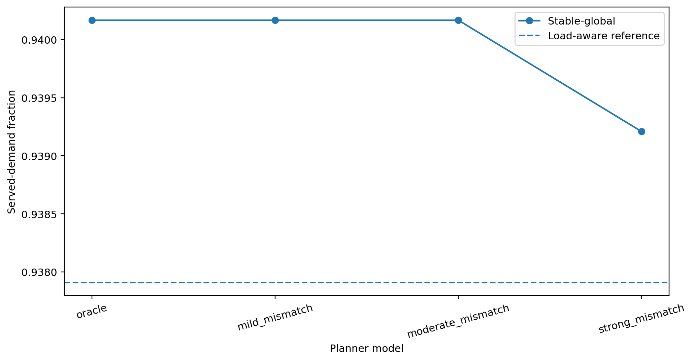

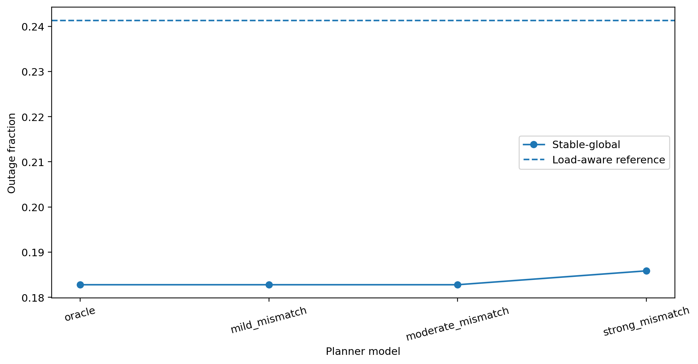

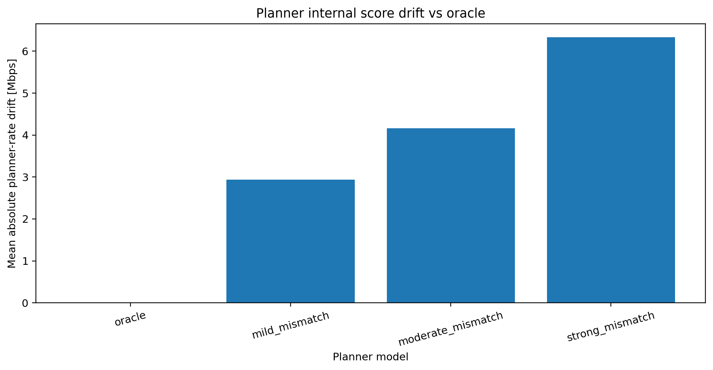

## 7. Zero-switch-penalty ablation

The no-switch variant retains the same global assignment structure but sets the switch penalty to zero. This isolates how much of the final controller's low churn is attributable to explicit stability regularization.

| Variant                 |   Served demand |   Mean satisfaction |   Outage |   P05 Mbps |   Jain |   Latency proxy |   HO rate |   Mean HOs |
|:------------------------|----------------:|--------------------:|---------:|-----------:|-------:|----------------:|----------:|-----------:|
| stable_global           |          0.9488 |              0.9577 |   0.1741 |     3.024  | 0.8727 |          1.3386 |    0.0015 |        4.4 |
| stable_global_no_switch |          0.9864 |              0.9892 |   0.0679 |     4.341  | 0.9645 |          1.0864 |    0.0382 |      109.9 |
| stable_global_oracle    |          0.949  |              0.9579 |   0.1737 |     3.0289 | 0.8731 |          1.3366 |    0.0015 |        4.2 |

The result is the expected control trade-off: the zero-switch variant can improve service metrics because it is freer to move users between APs, but it produces far more handovers. The normal stable-global controller therefore should be interpreted as a QoS/stability compromise, not as a controller that happens to avoid switching.

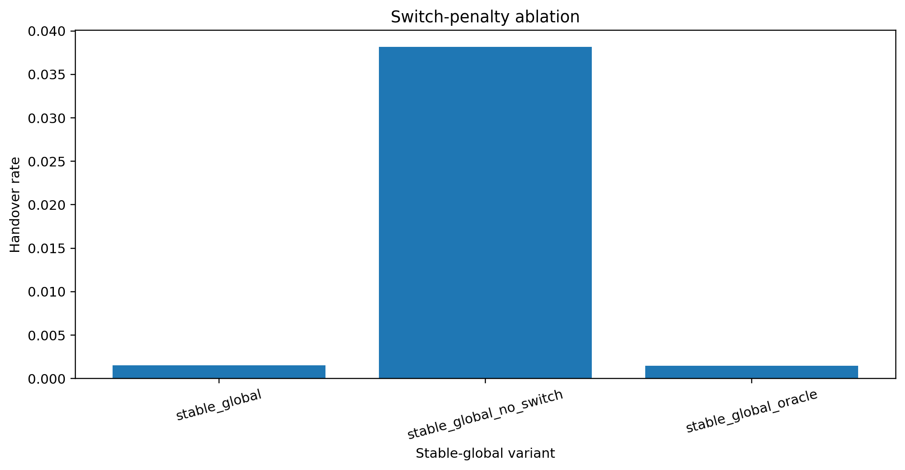

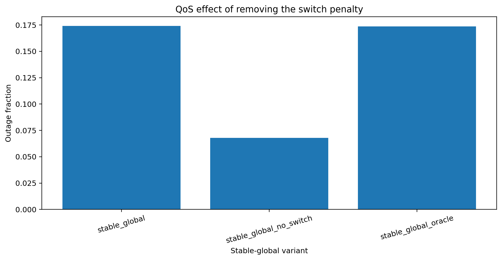

## 8. Disturbance sweep

|   Sigma | Policy        |   Served demand |   Outage |   P05 satisfaction |
|--------:|:--------------|----------------:|---------:|-------------------:|
|     0.8 | load_aware    |          0.9704 |   0.1433 |             0.8812 |
|     0.8 | stable_global |          0.9391 |   0.1828 |             0.7261 |
|     1.4 | load_aware    |          0.9647 |   0.1696 |             0.8526 |
|     1.4 | stable_global |          0.9384 |   0.1783 |             0.7157 |
|     2.1 | load_aware    |          0.9478 |   0.2142 |             0.7997 |
|     2.1 | stable_global |          0.9367 |   0.1731 |             0.7006 |
|     2.6 | load_aware    |          0.9358 |   0.245  |             0.769  |
|     2.6 | stable_global |          0.9351 |   0.1726 |             0.6893 |
|     3.2 | load_aware    |          0.9231 |   0.2817 |             0.7437 |
|     3.2 | stable_global |          0.9335 |   0.171  |             0.6788 |

## 9. Mobility x disturbance stress grid

The stress grid varies disturbance intensity and user mobility. Heatmaps are provided for both load-aware and stable-global together with their direct served-demand gain. The table also includes **P05 throughput** so the tail-QoS trade-off remains visible under stress rather than only in the seed study.

|   Sigma |   Max speed |   Load-aware served |   Stable-global served |   Served gain |   Load-aware P05 Mbps |   Stable-global P05 Mbps |   Stable-global P05 change [%] |   Stable-global HO rate |
|--------:|------------:|--------------------:|-----------------------:|--------------:|----------------------:|-------------------------:|-------------------------------:|------------------------:|
|     0.8 |         1.2 |              0.9765 |                 0.9624 |       -0.0141 |                3.8613 |                   3.3429 |                       -13.4268 |                  0.0023 |
|     0.8 |         2.3 |              0.9748 |                 0.9558 |       -0.019  |                3.8734 |                   3.2336 |                       -16.5177 |                  0.0023 |
|     0.8 |         2.8 |              0.9742 |                 0.9537 |       -0.0206 |                3.9012 |                   3.19   |                       -18.2316 |                  0.0023 |
|     3.2 |         1.2 |              0.9239 |                 0.945  |        0.0211 |                3.2304 |                   2.8805 |                       -10.8318 |                  0.0023 |
|     3.2 |         2.3 |              0.9259 |                 0.9385 |        0.0125 |                3.2481 |                   2.7875 |                       -14.1804 |                  0.0023 |
|     3.2 |         2.8 |              0.9295 |                 0.9354 |        0.006  |                3.2601 |                   2.7344 |                       -16.1248 |                  0.0023 |

All **6 disturbance/mobility combinations** are shown above. The underlying `joint_stress_grid.csv` retains the complete policy-by-seed matrix.

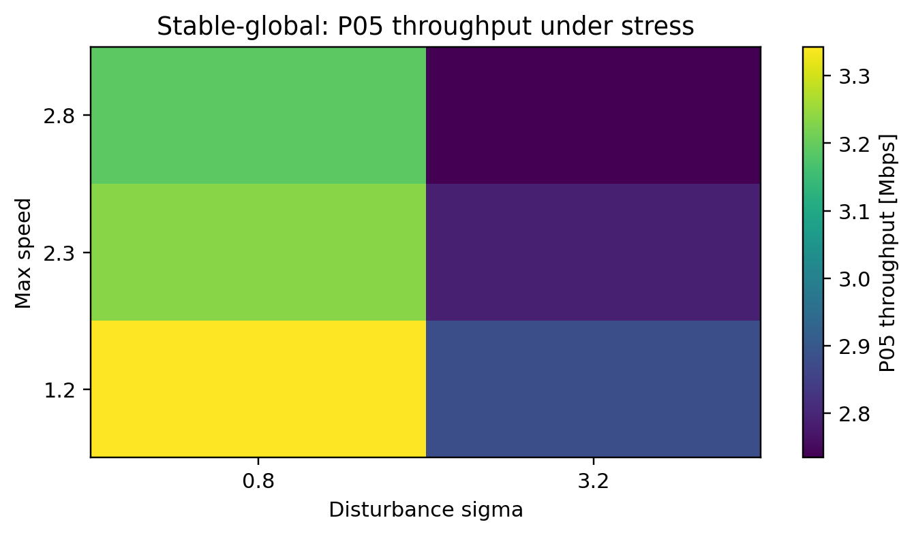

```{=latex}
\newpage
```

## 10. Prediction-horizon sensitivity

The corrected DARC implementation performs actual forward state prediction. The aggregate sensitivity is:

|   Horizon [steps] |   Served demand |   Outage |   P05 satisfaction |
|------------------:|----------------:|---------:|-------------------:|
|                 1 |          0.8115 |   0.4651 |             0.51   |
|                 3 |          0.8662 |   0.3835 |             0.568  |
|                 6 |          0.919  |   0.3054 |             0.6976 |
|                 9 |          0.9464 |   0.2363 |             0.7883 |
|                12 |          0.9505 |   0.2102 |             0.8042 |

The horizon remains a design parameter; the trend in this experiment is evidence that the forecasting mechanism is active, not proof that longer horizons are universally optimal.

## 11. Trace-driven replay

The same frozen core trace is replayed through the principal controller set. This is a reproducibility test, not external field validation.

| Policy              |   Served |   Outage |   P05 sat |   HO rate |   HOs |
|:--------------------|---------:|---------:|----------:|----------:|------:|
| load_aware          |   0.8709 |   0.3704 |    0.6144 |    0.2176 |   940 |
| darc                |   0.8185 |   0.4312 |    0.5123 |    0.0285 |   123 |
| robust_darc         |   0.8179 |   0.4292 |    0.51   |    0.028  |   121 |
| shield_darc         |   0.8159 |   0.4266 |    0.4933 |    0.0278 |   120 |
| stable_global       |   0.9307 |   0.2394 |    0.721  |    0.0019 |     8 |
| regime_orchestrator |   0.817  |   0.4255 |    0.498  |    0.0278 |   120 |

```{=latex}
\newpage
```

## 12. Runtime methodology and scaling

Runtime values are reported only under the **final release protocol**. The policy benchmark uses the frozen core trace, 180 simulation steps and 3 repeats; timing starts immediately before `DistMobSim.run()` and excludes trace generation, result serialization, figure generation and PDF generation. The scaling benchmark uses frozen traces at 24/6, 50/10 and 100/20 users/APs, with 60/60/30 steps and 2 repeats.

| Policy              |   Mean runtime [s] |   Std runtime [s] |   Steps |   Repeats |
|:--------------------|-------------------:|------------------:|--------:|----------:|
| hysteresis          |             0.0634 |            0.0035 |     180 |         3 |
| rssi                |             0.0636 |            0.0112 |     180 |         3 |
| ttt_handover        |             0.0937 |            0.0218 |     180 |         3 |
| load_aware          |             0.2982 |            0.0396 |     180 |         3 |
| q_learning          |             0.3868 |            0.0114 |     180 |         3 |
| darc                |             0.6902 |            0.0037 |     180 |         3 |
| robust_darc         |             0.6926 |            0.0131 |     180 |         3 |
| darc_no_obs         |             0.6988 |            0.0046 |     180 |         3 |
| stable_global       |             0.7111 |            0.0221 |     180 |         3 |
| shield_darc         |             0.7209 |            0.021  |     180 |         3 |
| regime_orchestrator |             0.7399 |            0.0487 |     180 |         3 |

The prior v10 report used an earlier implementation/workload and therefore its runtime numbers are **not directly comparable** with this release. This release intentionally avoids mixing those historical measurements into the performance claim.

```{=latex}
\newpage
```

|   Users |   APs | Policy        |   Runtime s |   ms/user-step |   Served demand |   Outage |   HO rate |
|--------:|------:|:--------------|------------:|---------------:|----------------:|---------:|----------:|
|      24 |     6 | load_aware    |      0.2004 |         0.1392 |          0.9586 |   0.2056 |    0.2938 |
|      24 |     6 | stable_global |      0.2902 |         0.2015 |          0.9715 |   0.1038 |    0.0031 |
|      50 |    10 | load_aware    |      0.5075 |         0.1692 |          0.9139 |   0.3167 |    0.312  |
|      50 |    10 | stable_global |      0.7295 |         0.2432 |          0.91   |   0.2723 |    0.0028 |
|     100 |    20 | load_aware    |      0.755  |         0.2517 |          0.9618 |   0.188  |    0.5853 |
|     100 |    20 | stable_global |      1.5029 |         0.501  |          0.9448 |   0.2105 |    0.006  |

## 13. Selected figures

### Core service quality

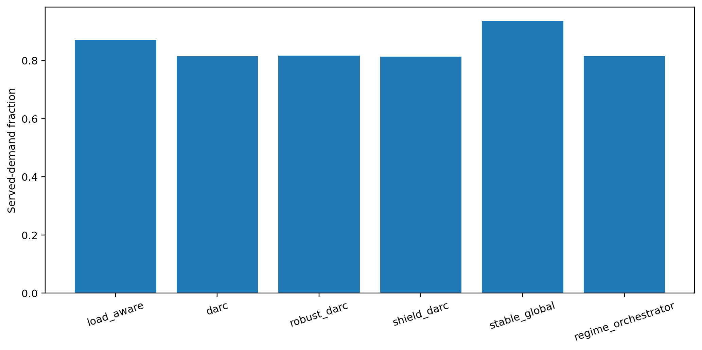

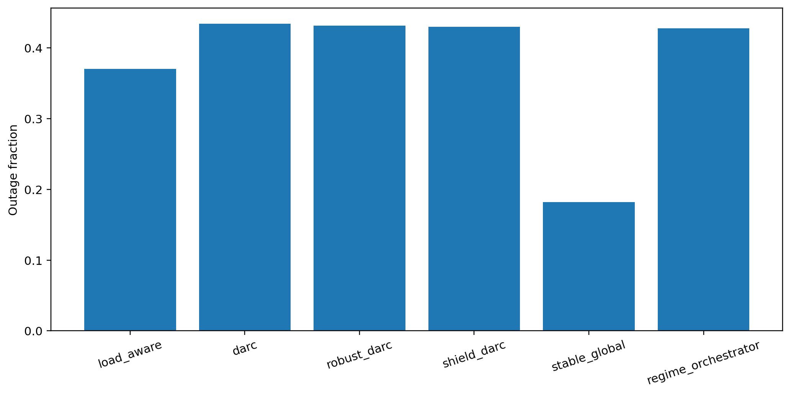

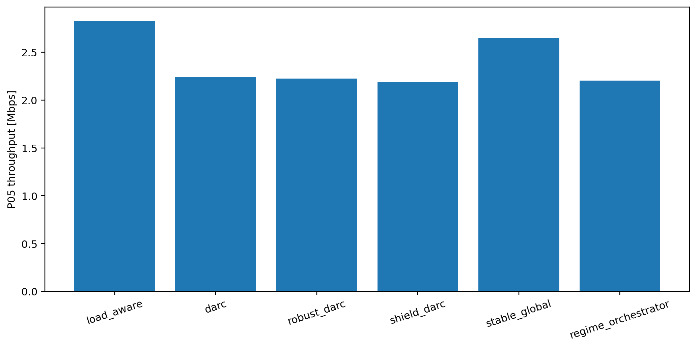

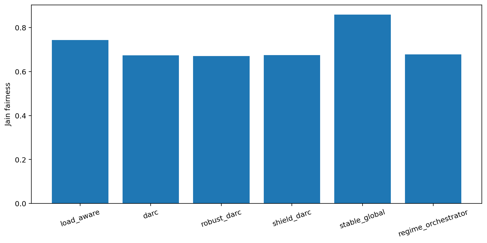

### Robustness and sensitivity

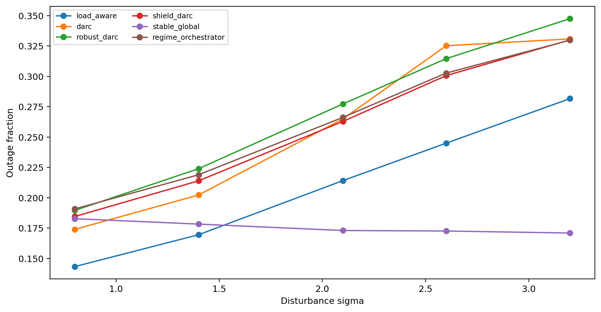

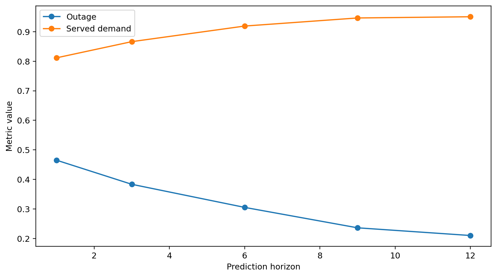

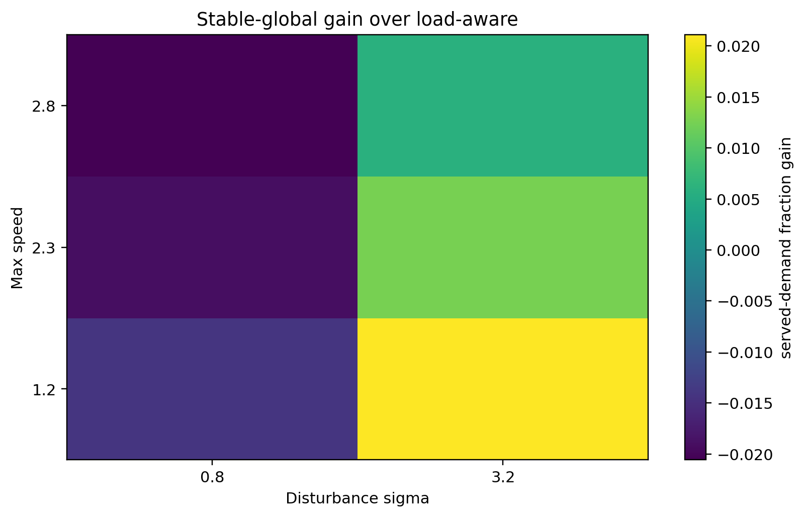

### Reproducible runtime

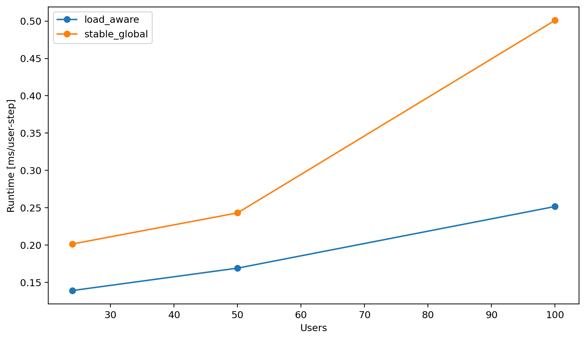

## 14. Reproducibility

From the repository root:

```bash
python -m pip install -r requirements.txt
python scripts/run_all_experiments.py
python scripts/build_report.py
pytest -q
```

The final bundle includes the generated traces, CSV/JSON result tables, figures, runtime protocol, tests and this report. The experiment runner and report builder consume the same authoritative `SimConfig`.

## 15. Optional external validation path

An external-trace route is documented without contaminating the primary counterfactual benchmark. The X-Fi public dataset contains real-world V2I Wi-Fi association attempts, GPS coordinates, signal measurements, association timing and TCP performance fields across four cities. These observables are suitable for validating mobility, association dwell time, signal variability and goodput relationships, but the public data do not expose every synchronized latent state used by DISTMOB's synthetic disturbance model. Therefore the repository keeps this as an optional validation extension rather than silently mixing incompatible observables into the main policy comparison. The raw third-party data are not redistributed in this repository.

See `external_trace/README.md` for provenance and the intended validation protocol.

## 16. Limitations

This remains a synthetic network-control testbed rather than packet-level 4G/5G validation. It does not model a complete PHY/MAC stack, interference scheduling, queues or signaling. Stable-global is centralized. Q-learning is intentionally lightweight. The planner model-mismatch test covers a small fixed family of proxy errors, not the full space of distribution shift.

## 17. Final takeaway

DISTMOB is strongest as a **research-engineering project combining simulation, predictive control, global optimization, statistical experimentation and reproducibility**. The final evidence supports a specific and defensible claim: stable-global can reduce outage and handover churn while improving fairness and latency proxy under the stated synthetic environment, and it retains an advantage under the moderate and strong planner/evaluator mismatches tested here, although the advantage erodes under the stronger perturbation. The cost is visible in P05 throughput both in the primary seed study and in the stress-grid view, and removing the switch penalty demonstrates that low churn is an explicit consequence of the stability objective rather than an accident of the environment.
